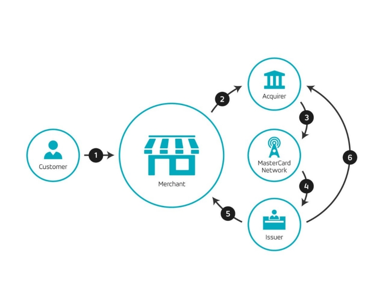

# Visa transaction flow

---

### Visa Payment Transaction Flow

**Card Holder** => **Merchant** <=> **Acquirer** <=> **VisaNet** <=> **Card Issuer**

### Visa Payment Process

Three stages involved:

**1. Authorization**
Issuer is responsible for the process of `approving/rejecting a transaction`.

**2. Clearing**
Transmit the final transaction from acquirer to issue with `calculated the fees and charges`.

**3. Settlement**
Actual `exchange of funds` between acquirer and issuer.

Process flow of final 2 stages (**Clearing** and **Settlement**)

.png>)

Let's compare the payment process of master card.
Basically, it's quite similar to the Visa network.

**Step 1: The customer pays with Mastercard**
The customer purchases goods/services from a merchant.

**Step 2: The payment is authenticated**
The merchant point-of-sale system captures the customer’s account information and securely sends it to the acquirer.

**Step 3: The transaction is submitted**
The merchant acquirer asks Mastercard to get an authorization from the customer’s issuing bank.

**Step 4: Authorization is requested**
Mastercard submits the transaction to the issuer for authorization.

**Step 5: Authorization response**
The issuing bank authorizes the transaction and routes the response back to the merchant.

**Step 6: Merchant payment**
The issuing bank routes the payment to the merchant’s acquirer who deposits the payment into the merchant’s account.

---

### References:

- [How Visa’s Payment System Works](http://blog.unibulmerchantservices.com/how-visas-payment-system-works/)

- [How the payment process works](https://www.mastercard.us/en-us/merchants/start-accepting/payment-process.html)
