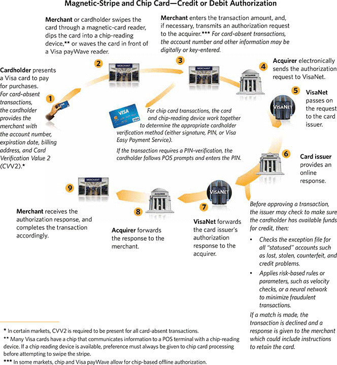

# Visa transaction flow

---

**Card Holder** => **Merchant** <=> **Acquirer** <=> **VisaNet** <=> **Card Issuer**

---

### Reference:

- [How Visa’s Payment System Works](http://blog.unibulmerchantservices.com/how-visas-payment-system-works/)
